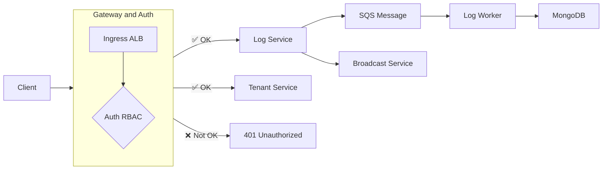

# Python log server
A log server write with Python and FastAPI
- [Live Demo](https://vue-dbml.devseason.com)

### 📘 Project APIs
| Method | Endpoint                       | Description                            | Tenant Scoped |
|--------|--------------------------------|----------------------------------------|----------------|
| POST   | `/api/v1/logs`                 | Create a log entry                     | ✅ Yes         |
| GET    | `/api/v1/logs`                 | Search/filter logs                     | ✅ Yes         |
| GET    | `/api/v1/logs/{id}`            | Get specific log entry                 | ✅ Yes         |
| GET    | `/api/v1/logs/export`          | Export logs                            | ✅ Yes         |
| GET    | `/api/v1/logs/stats`           | Get log statistics                     | ✅ Yes         |
| POST   | `/api/v1/logs/bulk`            | Bulk log creation                      | ✅ Yes         |
| DELETE | `/api/v1/logs/cleanup`         | Cleanup old logs                       | ✅ Yes         |
| WS     | `/api/v1/logs/stream`          | Real-time log streaming via WebSocket  | ✅ Yes         |
| GET    | `/api/v1/tenants`              | List accessible tenants (admin only)   | ❌ No (Admin)  |
| POST   | `/api/v1/tenants`              | Create a new tenant (admin only)       | ❌ No (Admin)  |

### Project structure folder
```text
logserver/
├── app/
│ ├── auth/ # Auth service (embedded in gateway, on AWS uses ALB + Lambda)
│ ├── log/ # Log API service
│ ├── log_worker/ # Background log processing (e.g., SQS consumer)
│ └── tenant/ # Tenant management service
│
├── k8s/
│ └── app/ # Kubernetes YAMLs for deploying services
│
└── scripts/ # Benchmarking and utility scripts
```

---

### Todo
- [x] Core audit log creation and retrieval API endpoints
- [x] Database setup and configuration (PostgreSQL/MongoDB/DynamoDB)
- [x] API Gateway or ALB setup and configuration
- [x] Basic search and filtering functionality
- [x] Database schema design and implementation with multi-tenant support
- [x] Authentication and authorization system with tenant isolation
- [x] Basic security controls and data validation
- [x] AWS SQS setup for background processing
- [x] Multi-tenant implementation and tenant management

---

### 🧱 High-Level Architecture

#### 🔹 1. Microservices Design

| Service       | Description |
|---------------|-------------|
| `auth`        | Authenticates requests (JWT), handles **RBAC** and **tenant isolation**. Deployed as a FastAPI service locally or as a **Lambda behind ALB** in AWS. |
| `log`         | Receives and serves logs (create, search, export, stats, cleanup). Stores data in MongoDB. |
| `log_worker`  | Background processor that consumes log events from **SQS** (or ElasticMQ locally). Handles async processing and storage. |
| `tenant`      | Manages tenant records (create, list). |

---

#### 🔹 2. Core Features

- ✅ **Multi-Tenancy**: Isolates data by `tenant_id`, supports role-based access (`admin`, `auditor`, `viewer`)
- ✅ **Event-Driven Logging**: Log API sends events to SQS, processed asynchronously by `log_worker`
- ✅ **Real-time Log Streaming**: WebSocket API `/logs/stream` per tenant
- ✅ **RBAC Auth**: JWT-based auth with tenant-scoped role validation

---

### 🛠️ Deployment Layers

| Layer         | Local (Minikube)                  | Production (AWS)                     |
|---------------|-----------------------------------|--------------------------------------|
| **Gateway**   | `ingress-nginx`                   | AWS `ALB` with routing to Lambda     |
| **Auth**      | FastAPI service                   | AWS Lambda (Auth RBAC Handler)       |
| **Message**   | `ElasticMQ`                       | AWS `SQS`                            |
| **Database**  | `MongoDB` (Docker)                | MongoDB Atlas or EC2-hosted instance |
| **K8s Infra** | `Tilt`, `Makefile`, `Minikube`    | EKS, ArgoCD, Terraform                |

---

### 🔁 Request Flow

```text
Client
  ↓
Ingress (nginx / ALB)
  ↓
Auth Service (or Lambda)
  ├─ [✅ OK] → Log Service → MongoDB
  ├─ [✅ OK] → Tenant Service
  └─ [❌ Not OK] → 401 Unauthorized
```

---

## Installation

1. **Clone the Repository**
    Install tilt: https://tilt.dev/
    Install docker: https://www.docker.com/

    Run the following commands to clone and set up the project:
    Tilt will watch services code changes and reload service
    ```bash
    git clone https://github.com/rxzcode/logserver.git
    cd logserver
    make up # It bring up minikube K8S cluster, run all apps, services with tilt
    minikube tunnel # Use it to open port for K8S server: http://localhost/api/v1/logs
    ```

    Run benchmark, it bring a minikube pod to run Hey
    ```bash
    make benchmark
    ```

    For local dev IDE linting, linking libs
    ```bash
    # At root folder
    python -m .venv
    source .env/bin/activate
    pip install -r requirements.txt
    ```

2. **Deploy AWS K8S**:
    ```bash
    # Create cluster
    # Use tilt production
    make up-prod

3. **License**:
   - This project is licensed under the MIT License. Please provide attribution to @rxzcode.

# Extra: benchmark result
- With 10k total - 1k concurrent
