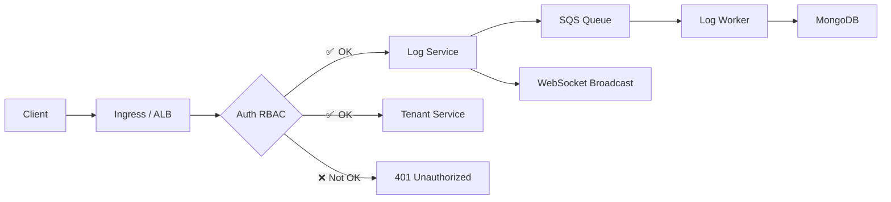

# 🚀 Python Log Server

A high-performance, multi-tenant log server built with **Python** and **FastAPI**.

🔗 [**Live Demo**](https://vue-dbml.devseason.com)

---

## 📘 API Endpoints

| Method | Endpoint                     | Description                           | Tenant Scoped |
|--------|------------------------------|---------------------------------------|----------------|
| POST   | `/api/v1/logs`               | Create a log entry                    | ✅ Yes         |
| GET    | `/api/v1/logs`               | Search/filter logs                    | ✅ Yes         |
| GET    | `/api/v1/logs/{id}`          | Get a specific log entry              | ✅ Yes         |
| GET    | `/api/v1/logs/export`        | Export logs                           | ✅ Yes         |
| GET    | `/api/v1/logs/stats`         | Retrieve log statistics               | ✅ Yes         |
| POST   | `/api/v1/logs/bulk`          | Bulk log creation                     | ✅ Yes         |
| DELETE | `/api/v1/logs/cleanup`       | Clean up old logs                     | ✅ Yes         |
| WS     | `/api/v1/logs/stream`        | Real-time log streaming (WebSocket)   | ✅ Yes         |
| GET    | `/api/v1/tenants`            | List tenants (Admin only)             | ❌ No          |
| POST   | `/api/v1/tenants`            | Create a tenant (Admin only)          | ❌ No          |

---

## 📁 Project Structure

```text
logserver/
├── app/
│   ├── auth/         # Auth service (embedded or AWS Lambda behind ALB)
│   ├── log/          # Log API service
│   ├── log_worker/   # Background SQS log processing
│   └── tenant/       # Tenant management
│
├── k8s/
│   └── app/          # Kubernetes deployment YAMLs
│
└── scripts/          # Benchmarking and utility scripts
```

---

## ✅ Todo Summary

- [x] Core audit log APIs
- [x] Database setup (PostgreSQL, MongoDB, or DynamoDB)
- [x] Gateway/ALB configuration
- [x] Search and filter capabilities
- [x] Multi-tenant DB schema
- [x] JWT-based auth with role scoping
- [x] Security and validation
- [x] SQS for async processing
- [x] Tenant management

---

## 🧱 High-Level Architecture

### 🔹 Microservices

| Service       | Responsibility |
|---------------|----------------|
| `auth`        | JWT authentication, RBAC, tenant isolation. Runs as FastAPI or AWS Lambda. |
| `log`         | Handles all log CRUD, filtering, exporting, and statistics. |
| `log_worker`  | Background processor (SQS/ElasticMQ consumer). |
| `tenant`      | Tenant creation and listing (admin access). |

---

### 🔹 Key Features

- **Multi-Tenancy**: Isolates data per `tenant_id`, supports roles: `admin`, `auditor`, `viewer`.
- **Event-Driven**: Logs sent via API → SQS → async `log_worker`.
- **Real-Time Streaming**: WebSocket `/logs/stream` for tenant-specific updates.
- **RBAC Authentication**: Role-based access via JWT.

---

## ⚙️ Deployment Overview

| Layer         | Local (Minikube)                | Production (AWS)                     |
|---------------|----------------------------------|--------------------------------------|
| Gateway       | `ingress-nginx`                 | AWS ALB                              |
| Auth          | FastAPI microservice            | AWS Lambda (RBAC handler)            |
| Messaging     | `ElasticMQ`                     | AWS SQS                              |
| Database      | Local MongoDB container         | MongoDB Atlas or EC2                 |
| K8s Infra     | Tilt, Makefile, Minikube        | EKS, ArgoCD, Terraform               |

---

## 🔁 Request Flow (Textual)

```text
Client
  ↓
Ingress (nginx or ALB)
  ↓
Auth Service (JWT + RBAC)
  ├─ [✅ OK] → Log Service → MongoDB
  ├─ [✅ OK] → Tenant Service
  └─ [❌ Not OK] → 401 Unauthorized
```

## 🔁 Request Flow (Mermaid Diagram)



---

## 🧪 Installation & Development

### 1. Clone and Run Locally

> Requires: [Tilt](https://tilt.dev), [Docker](https://www.docker.com/), [Minikube](https://minikube.sigs.k8s.io/)

```bash
git clone https://github.com/rxzcode/logserver.git
cd logserver
make up             # Starts Minikube and runs services via Tilt
minikube tunnel     # Opens access to http://localhost/api/v1/logs
```

### 2. Run Benchmark

```bash
make benchmark      # Launches a benchmarking pod inside Minikube using hey
```

### 3. Local Python Development

```bash
# At root folder
python -m venv .venv
source .venv/bin/activate
pip install -r requirements.txt
```

### 4. Deploy to AWS (Production)

```bash
# Spin up production infrastructure and deploy using Tilt
make up-prod
```

---

## 📜 License

This project is licensed under the **MIT License**.  
Contributions welcome — Happy Coding! 😊

---

## 📊 Benchmark Results, Others
> Postman API:
[📥 Download Postman Collection](./extra/LogServer.postman_collection.json)

> Load Test: 10,000 requests, 1,000 concurrent

