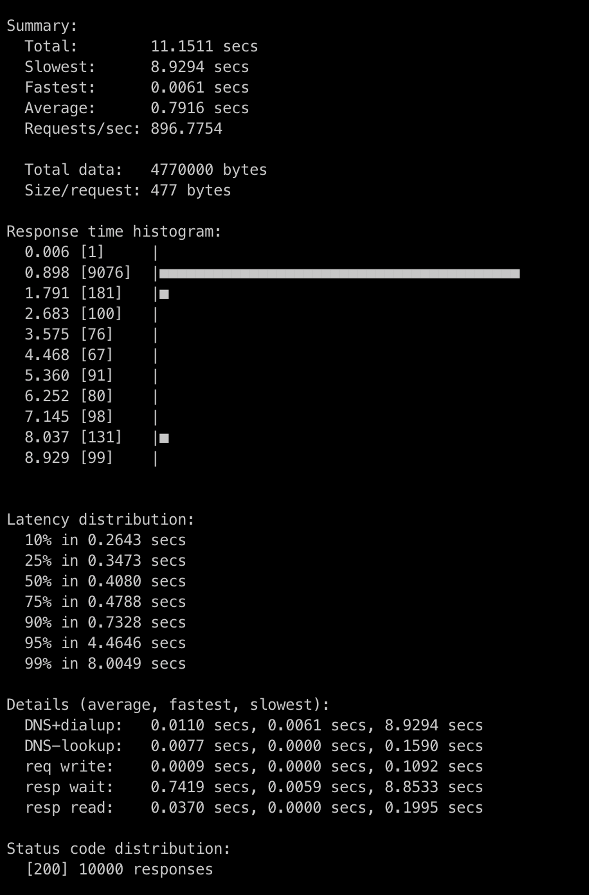

# Python log server
A log server write with Python and FastAPI
- Use K8S
- Local use with docker + minikube + tilt
- Local use nginx-ingress   - AWS ALB
- Local use ElasticMQ       - AWS SQS
- Local use MongoDB service - AWS Managed Atlas

- [Live Demo](https://vue-dbml.devseason.com)



### Project APIs
POST   /api/v1/logs                   # Create log entry (with tenant ID)
GET    /api/v1/logs                   # Search/filter logs (tenant-scoped)
GET    /api/v1/logs/{id}              # Get specific log entry (tenant-scoped)
GET    /api/v1/logs/export            # Export logs (tenant-scoped)
GET    /api/v1/logs/stats             # Get log statistics (tenant-scoped)
POST   /api/v1/logs/bulk              # Bulk log creation (with tenant ID)
DELETE /api/v1/logs/cleanup           # Cleanup old logs (tenant-scoped)
WS     /api/v1/logs/stream            # Real-time log streaming (tenant-scoped)
GET    /api/v1/tenants                # List accessible tenants (admin only)
POST   /api/v1/tenants                # Create new tenant (admin only)

### Project structure folder

---

## Todo
- [x] Core audit log creation and retrieval API endpoints
- [x] Database setup and configuration (PostgreSQL/MongoDB/DynamoDB)
- [x] API Gateway or ALB setup and configuration
- [x] Basic search and filtering functionality
- [x] Database schema design and implementation with multi-tenant support
- [x] Authentication and authorization system with tenant isolation
- [x] Basic security controls and data validation
- [x] AWS SQS setup for background processing
- [x] Multi-tenant implementation and tenant management

---

## Tools
- ⚡ **Fast Development**: Docker, Minikube, Tilt
- 🛠️ **Component-Based Architecture**:
    - App Services: auth, log, tenant, log-worker (Python, fastAPI)
    - Database: MongoDB (local), Atlas (AWS)
    - Gateway: ingress-nginx (local), ingress-alb (AWS)
    - Message: ElasticMQ (local), SQS (AWS)

---

## Installation

1. **Clone the Repository**
    Install tilt: https://tilt.dev/
    Install docker: https://www.docker.com/

    Run the following commands to clone and set up the project:
    ```bash
    git clone https://github.com/rxzcode/logserver.git
    cd logserver
    make up
    minikube tunnel # Use it to open port for K8S server: http://localhost/api/v1/logs
    ```
    Tilt will watch services code changes and reload service


2. **Deploy AWS K8S**:
    ```bash
    # Create cluster
    # Use tilt production
    make up-prod

3. **License**:
   - This project is licensed under the MIT License. Please provide attribution to @rxzcode.

# Extra - this repo is a module of project
- ZCODE - DBML - Crud generate and sync code - low code
- This use DBML, AI gen DBML, gen CODE for front end, back end (expressjs, vuejs)


